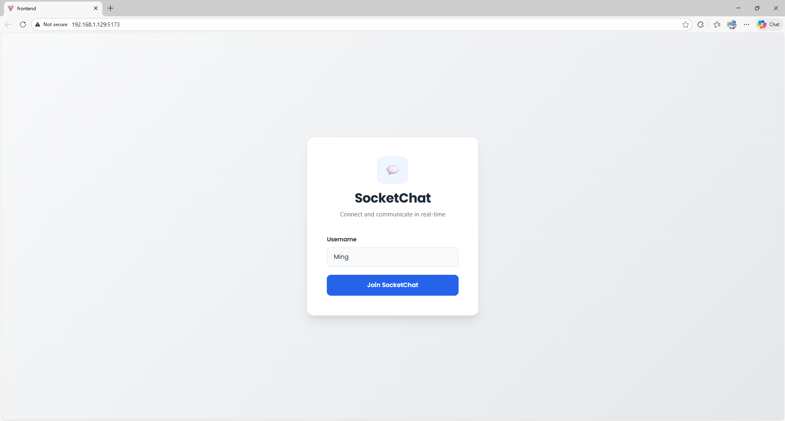
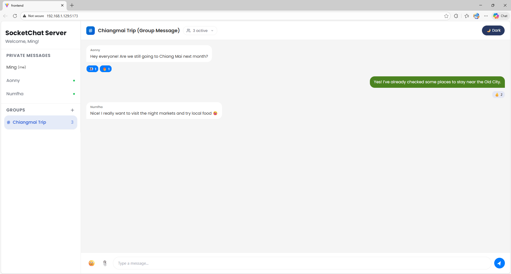
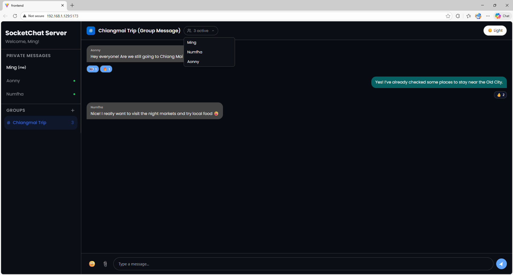
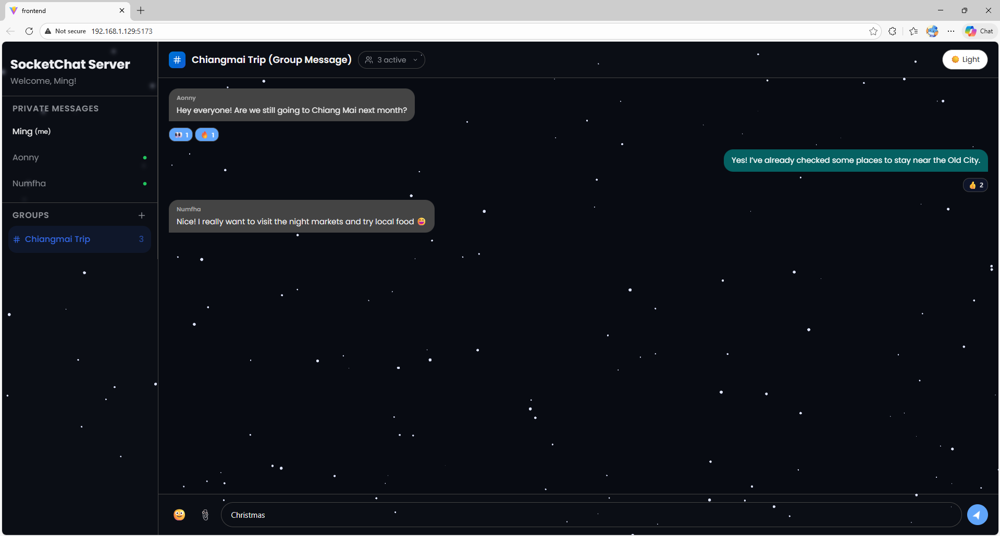
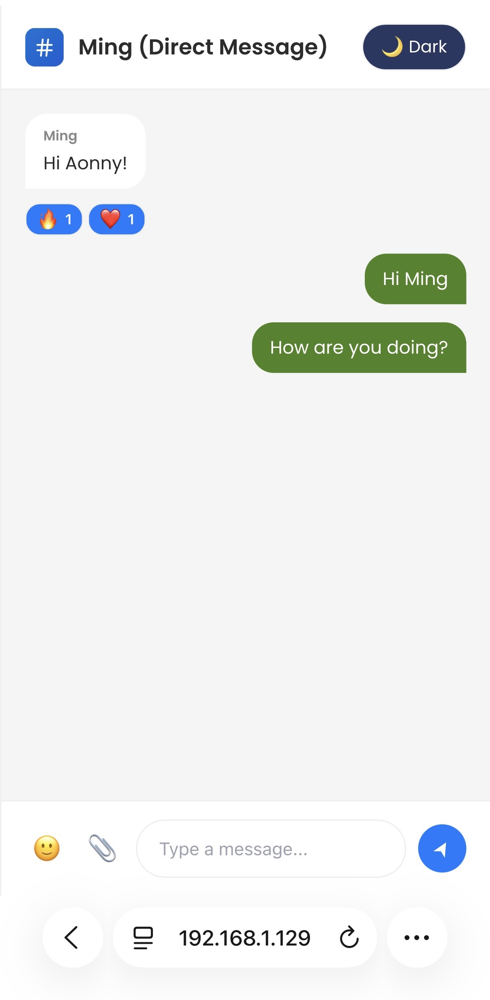

# Online chat via Socket programming

## Testing from other devices on the same LAN

If you want to open the frontend on a phone or another PC and connect to the backend running on your development machine, follow these steps:

1. Find your development machine's LAN IPv4 address (on Windows run `Get-NetIPAddress -AddressFamily IPv4 | Format-Table IPAddress, InterfaceAlias, PrefixLength, AddressState` (On Windows PowerShell) or `ipconfig` and look for "IPv4 Address" under your active adapter).
2. Start the backend server (default port 3001):

	- From the backend folder: `npm run dev`.

3. Start the frontend with host enabled so other devices can reach the Vite dev server:

	- In the frontend folder: `npm run dev`.

4. Configure the frontend to connect to the backend by setting `VITE_SERVER_URL` in an `.env` with:

	VITE_SERVER_URL=http://<YOUR_LAN_IP>:3001

	Example: `VITE_SERVER_URL=http://192.168.1.10:3001`.

5. Make sure your OS firewall allows incoming connections on the backend port (3001), or add a rule for Node.

6. Open the frontend from the other device using the dev server address, e.g. `http://192.168.1.10:5173` (or whatever port Vite reports).

## 📸 Frontend Preview

**Login Page**  
Simple and clean login interface for entering the chat application.

**Private Chat**  
One-on-one real-time messaging with instant message delivery via Socket programming.

**Group Chat**  
Multi-user chat room with real-time message updates and a live dropdown showing active group members.

**Dark Theme & UI Features**  
Additional features include a dark theme toggle, emoji support, and a real-time member list dropdown for better user experience.

**Seasonal Easter Egg (Christmas Mode 🎄❄️)**  
Typing the keyword **"Christmas"** in the message input (without sending it) triggers a festive snow animation on the screen as a fun Easter egg.

**Mobile Support**  
The application is fully responsive and works smoothly on mobile devices and tablets.

